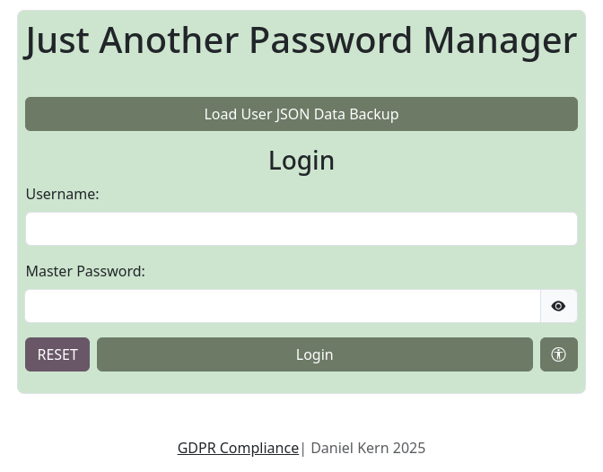

# 
JAPM

#### 
(Just Another Password Manager)

### About the project
JAPM (Just Another Password Manager) is a password manager written in HTML, CSS and JS using the Web Crypto API.

#### Features
- Multi-user support
- Fully local data storage
    - Your data never leaves your device, and is always encrypted with your key before storage
- OpenDyslexic Font support
- AES-256 encryption on all stored data
- (Encrypted) JSON Data Backup
- Weak password warnings
- Strong master password requirements
- Password Generator
    - Length 5 - 70
    - Character set requirements
        - Uppercase
        - Lowercase
        - Numbers
        - Symbols (?-+=/...)
    - Generator History

### Security
All user data is encrypted before being saved in LocalStorage, and before being written to the JSON backup file. 

All user data is stored locally, it never leaves your device, meaning only you can access it ever.

Your data is encrypted using the industry standard AES-256 CBC algorithm. Your key is derived from your master password using the PBKDF2 SHA256 algorithms (10,000 iterations).

### Accessibility
JAPM was created with accessibility in mind from the start. JAPM features the OpenDyslexic font, which greatly improves clarity for people with dyslexia. JAPM also features a calm pastel high contrasting colour scheme which aids visually impaired individuals.
